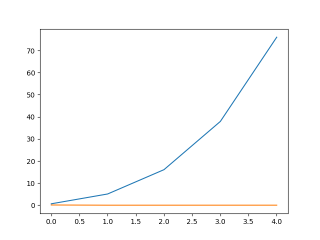
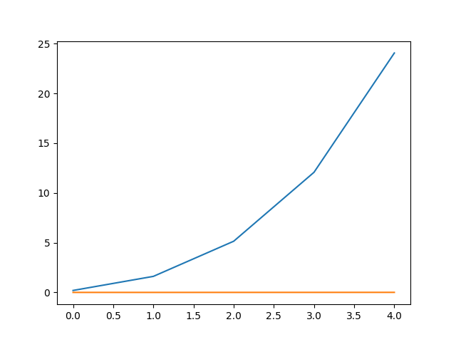

# Метод Гаусса  
## Задание:  
Сравнить решение СЛАУ методом Гаусса библиотечной функцией np.linalg.solve со всей реализацией на случайной матрицей с диагональным преобладанием размером 100x100, 200x200 и т.д.
Провести несколько экспериментов, пока время счета меньше 1 сек. Построить графики зависимостей.  

## Что выводит программа?  
for n = 100 ||x - x_compare|| = 2.3111108307014155e-16  
for n = 200 ||x - x_compare|| = 2.0158624124883814e-14  
for n = 300 ||x - x_compare|| = 7.773429547796606e-13  
for n = 400 ||x - x_compare|| = 6.884508943663701e-11  
for n = 500 ||x - x_compare|| = 1.6389731531537222e-08  
x - вектор который посчитан методом Гаусса  
x_compare - вектор, который получен в результате использования функции np.linalg.solve  
Программа выводит норму вектора (x - x_compare), чтобы показать как сильно отличаются значения.  
### График  
​
# Метод Холецкого  
## Задание:  
Сравнить решение СЛАУ методом Холецкого библиотечной функцией np.linalg.cholesky со своей реализацией на случайной положительно определенной матрицей с диагональным преобладанием размером  100x100, 200x200  и т.д. Провести несколько экспериментов, пока время счета меньше 1 сек. Построить графики зависимостей.  
## Что выводит программа?
100  
Определитель L: (1.0, 195.7928560035155)   
Определитель L_compare (1.0, 195.7928560035155)  
200  
Определитель L: (1.0, 460.6767378278254)  
Определитель L_compare (1.0, 460.6767378278254)  
300  
Определитель L: (1.0, 752.2044113839638)  
Определитель L_compare (1.0, 752.2044113839636)  
400  
Определитель L: (1.0, 1059.9773560725243)  
Определитель L_compare (1.0, 1059.9773560725243)  
500  
Определитель L: (1.0, 1380.7255727785268)  
Определитель L_compare (1.0, 1380.7255727785268)  
Где L - матрица полученная методом Холецкого  
L_compare - матрица полученная через функцию np.cholesky  
#График:

